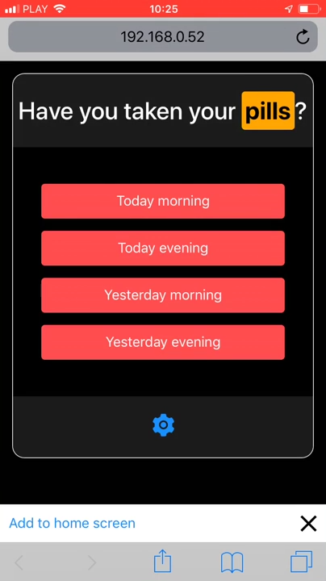

# react-add-to-homescreen

Bringing your PWA app to iOS. Evidently.



## What is it? 
`react-add-to-homescreen` allows you to inform the iOS users that your web app is installable on the iOS home screen. It mimics the behavior of Android's *Add to home screen* widget visible when the user visits your PWA.

## Installation
```shell
$ yarn react-add-to-homescreen
```

## Demo
You can check out the demo Progressive Web App [here](https://pills-pwa.netlify.com/). I am not the designer of this one though 😎

## Usage
`react-add-to-homescreen` is designed to be as simple as possible. First import the component:
```javascript
import AddToHomescreen from 'react-add-to-homescreen';
```

Then add the component to the main component of your app:
```js
<AddToHomescreen
  onAddToHomescreenClick={this.handleAddToHomescreenClick}
/>
```

Finally, create a handler for the banner:
```js
handleAddToHomescreenClick = () => {
  alert(`
    1. Open Share menu
    2. Tap on "Add to Home Screen" button`
  );
};
```

## Contributing
If you have comments, complaints, or ideas for improvements, feel free to open an issue or a pull request! If you are using or intend to use `react-add-to-homescreen`, please let me know 🙂

## License
`react-add-to-homescreen` was created by [@kkoscielniak](https://github.com/kkoscielniak). It is available under the MIT license. See the LICENSE file for more info.
