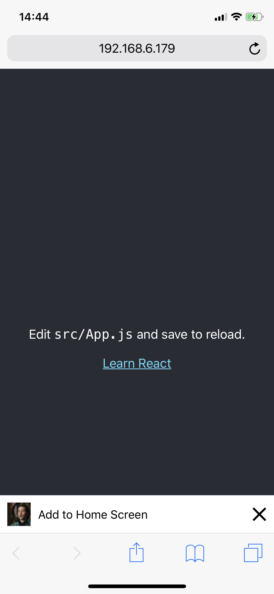

# react-add-to-homescreen

[](https://circleci.com/gh/kkoscielniak/react-add-to-homescreen/tree/master) [](https://opensource.org/licenses/MIT) [](https://coveralls.io/github/kkoscielniak/react-add-to-homescreen?branch=master)
[](https://github.com/prettier/prettier)

Bringing your PWA app to iOS. Evidently.



## What is it?

`react-add-to-homescreen` allows you to inform the iOS users that your web app is installable on the iOS home screen. It mimics the behavior of Android's _Add to home screen_ widget visible when the user visits your PWA.

## Installation

```shell
$ yarn react-add-to-homescreen
```

## Demo

You can check out the demo Progressive Web App [here](https://pills-pwa.netlify.com/). I am not the designer of this one though 😎

## Usage

`react-add-to-homescreen` is designed to be as simple as possible. First import the component:

```javascript
import AddToHomescreen from 'react-add-to-homescreen';
```

Then add the component to the main component of your app:

```js
<AddToHomescreen onAddToHomescreenClick={this.handleAddToHomescreenClick} />
```

Finally, create a handler for the banner:

```js
handleAddToHomescreenClick = () => {
  alert(`
    1. Open Share menu
    2. Tap on "Add to Home Screen" button`);
};
```

## Options

All options are passed as props.

| Prop                     | Type     | Description                      |
| ------------------------ | -------- | -------------------------------- |
| `onAddToHomescreenClick` | function | function to call on banner click |
| `title?`                 | string   | Custom title for banner          |
| `icon?`                  | string   | Icon for banner                  |

## Contributing

If you have comments, complaints, or ideas for improvements, feel free to open an issue or a pull request! If you are using or intend to use `react-add-to-homescreen`, please let me know 🙂

## License

`react-add-to-homescreen` was created by [@kkoscielniak](https://github.com/kkoscielniak). It is available under the MIT license. See the LICENSE file for more info.
